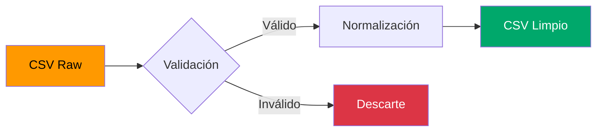
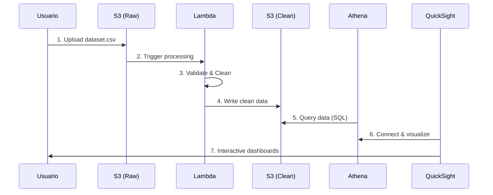

<div align="center">

# 🚀 AWS Big Data Architecture

### Implementación de Arquitectura Big Data en AWS con Servicios Serverless

[](https://aws.amazon.com/)
[](https://python.org/)
[](LICENSE)
[]()

*Solución cloud completa para procesamiento de datos masivos utilizando servicios nativos de AWS*

[Arquitectura](#-arquitectura) •
[Quick Start](#-quick-start) •
[Documentación](#-documentación) •
[Consultas SQL](#-consultas-de-ejemplo) •
[Visualización](#-amazon-quicksight)

---

</div>

## 📋 Tabla de Contenidos

- [Introducción](#-introducción)
- [Objetivos](#-objetivos)
- [Dataset](#-dataset)
- [Arquitectura](#-arquitectura)
- [Servicios AWS](#-servicios-aws-utilizados)
- [Requisitos Previos](#-requisitos-previos)
- [Quick Start](#-quick-start)
- [Configuración Detallada](#-configuración-detallada)
- [Consultas SQL](#-consultas-de-ejemplo)
- [Visualización](#-amazon-quicksight)
- [Costos](#-costos-y-free-tier)
- [Seguridad](#-seguridad-y-privacidad)
- [Estructura del Proyecto](#-estructura-del-proyecto)
- [Roadmap](#-roadmap)
- [Autor](#-autor)

---

## 🎯 Introducción

Este proyecto implementa una **arquitectura serverless en la nube** orientada al procesamiento de datos masivos utilizando servicios nativos de AWS. La solución permite:

| Capacidad | Descripción |
|-----------|-------------|
| 📦 **Almacenamiento** | Dataset real almacenado en S3 con alta durabilidad |
| 🔄 **Transformación** | Limpieza y normalización automática de datos |
| 🔍 **Consultas** | Análisis SQL sin administrar servidores |
| 📊 **Visualización** | Dashboards interactivos a nivel de negocio |

> [!NOTE]
> La solución aprovecha el **Free Tier de AWS**, optimizando costos para entornos académicos y de desarrollo.

---

## 🎯 Objetivos

### Objetivo General

Implementar una solución cloud bajo el paradigma Big Data utilizando AWS, que permita cargar un dataset real, limpiarlo mediante backend serverless, generar consultas analíticas con SQL y visualizar resultados empresariales.

### Objetivos Específicos

- [x] Comprender el ecosistema de servicios Big Data en AWS
- [x] Diseñar arquitectura con almacenamiento, procesamiento, consultas y visualización
- [x] Implementar flujo de trabajo sobre dataset de taxis NYC
- [x] Evaluar aspectos de costos y limitaciones del Free Tier
- [x] Documentar técnicamente la solución

---

## 📊 Dataset

**Fuente:** NYC Taxi Trips (viajes de taxi con información de tarifas y coordenadas)

| Propiedad | Valor |
|-----------|-------|
| **Formato** | CSV |
| **Tamaño** | > 100 MB |
| **Ubicación Raw** | `s3://ulacit-datos-masivos/input/dataset.csv` |
| **Ubicación Clean** | `s3://ulacit-datos-masivos/output/dataset_limpio.csv` |

### Esquema de Datos

```
┌─────────────────────┬────────────────────────────────────────┐
│ Campo               │ Descripción                            │
├─────────────────────┼────────────────────────────────────────┤
│ key                 │ Identificador único del registro       │
│ fare_amount         │ Monto de la tarifa (USD)               │
│ pickup_datetime     │ Fecha y hora de inicio del viaje       │
│ pickup_longitude    │ Longitud del punto de recogida         │
│ pickup_latitude     │ Latitud del punto de recogida          │
│ dropoff_longitude   │ Longitud del destino                   │
│ dropoff_latitude    │ Latitud del destino                    │
│ passenger_count     │ Número de pasajeros                    │
└─────────────────────┴────────────────────────────────────────┘
```

### Transformaciones Aplicadas



- ✅ Eliminación de filas con valores vacíos o inválidos
- ✅ Normalización de `pickup_datetime` → `yyyy-MM-dd HH:mm:ss`
- ✅ Validación de tipos numéricos (coordenadas, tarifas, pasajeros)
- ✅ Generación de CSV optimizado para Athena

---

## 🏗 Arquitectura

```
┌─────────────────────────────────────────────────────────────────────────────┐
│                         AWS BIG DATA ARCHITECTURE                           │
├─────────────────────────────────────────────────────────────────────────────┤
│                                                                             │
│    ┌──────────┐     ┌──────────┐     ┌──────────┐     ┌──────────┐         │
│    │          │     │          │     │          │     │          │         │
│    │    S3    │────▶│  Lambda  │────▶│    S3    │────▶│  Athena  │         │
│    │  (Raw)   │     │ (Clean)  │     │ (Clean)  │     │  (SQL)   │         │
│    │          │     │          │     │          │     │          │         │
│    └──────────┘     └──────────┘     └──────────┘     └────┬─────┘         │
│         │                                                   │               │
│         │              ┌──────────┐                         │               │
│         └──────────────│   Glue   │─────────────────────────┘               │
│                        │ Catalog  │                         │               │
│                        └──────────┘                         │               │
│                                                             ▼               │
│                                                      ┌──────────┐          │
│                                                      │QuickSight│          │
│                                                      │(Dashbrd) │          │
│                                                      └──────────┘          │
│                                                                             │
└─────────────────────────────────────────────────────────────────────────────┘
```

### Flujo de Datos



---

## ☁️ Servicios AWS Utilizados

| Servicio | Rol | Justificación |
|:--------:|-----|---------------|
|  | Almacenamiento | Alta durabilidad (99.999999999%), escalabilidad ilimitada |
|  | Procesamiento | Serverless, pago por uso, escalado automático |
|  | Consultas SQL | Data warehouse serverless, sin administración |
|  | Catálogo | Esquemas centralizados, descubrimiento de datos |
|  | Visualización | BI gestionado, integración nativa |

---

## 📋 Requisitos Previos

> [!IMPORTANT]
> Asegúrate de cumplir con todos los requisitos antes de comenzar.

- [ ] Cuenta de AWS activa con acceso al Free Tier
- [ ] QuickSight habilitado en la misma región que Athena (`us-east-2`)
- [ ] Python 3.12 (para desarrollo local de Lambda)
- [ ] Permisos IAM para S3, Lambda, Athena, Glue y QuickSight

---

## ⚡ Quick Start

### 1️⃣ Clonar el repositorio

```bash
git clone https://github.com/tu-usuario/aws-bigdata-architecture.git
cd aws-bigdata-architecture
```

### 2️⃣ Configurar S3

```bash
# Crear bucket
aws s3 mb s3://ulacit-datos-masivos --region us-east-2

# Subir dataset
aws s3 cp dataset.csv s3://ulacit-datos-masivos/input/dataset.csv
```

### 3️⃣ Desplegar Lambda

```bash
# Empaquetar función
cd aws/lambda
zip lambda_function.zip lambda_function.py

# Crear función (reemplazar ROLE_ARN)
aws lambda create-function \
    --function-name data-cleaner \
    --runtime python3.12 \
    --handler lambda_function.lambda_handler \
    --role arn:aws:iam::ACCOUNT_ID:role/lambda-s3-role \
    --zip-file fileb://lambda_function.zip
```

### 4️⃣ Ejecutar pipeline

```bash
# Invocar Lambda
aws lambda invoke \
    --function-name data-cleaner \
    --payload '{}' \
    response.json

cat response.json
```

---

## 📖 Configuración Detallada

### Amazon S3

<details>
<summary><b>📁 Estructura del Bucket</b></summary>

```
ulacit-datos-masivos/
├── input/
│   └── dataset.csv          # Dataset original
├── output/
│   └── dataset_limpio.csv   # Dataset procesado
└── athena-results/          # Resultados de consultas
```

</details>

### AWS Lambda

<details>
<summary><b>⚙️ Configuración de la Función</b></summary>

| Parámetro | Valor |
|-----------|-------|
| Runtime | Python 3.12 |
| Handler | `lambda_function.lambda_handler` |
| Memory | 256 MB |
| Timeout | 5 minutos |

**Variables de Entorno:**

```bash
BUCKET_NAME=ulacit-datos-masivos
INPUT_KEY=input/dataset.csv
OUTPUT_KEY=output/dataset_limpio.csv
```

</details>

<details>
<summary><b>📝 Código Fuente</b></summary>

```python
import boto3
import csv
import io
from datetime import datetime
import os

s3 = boto3.client('s3')

BUCKET_NAME = os.environ.get("BUCKET_NAME", "ulacit-datos-masivos")
INPUT_KEY   = os.environ.get("INPUT_KEY", "input/dataset.csv")
OUTPUT_KEY  = os.environ.get("OUTPUT_KEY", "output/dataset_limpio.csv")


def es_fila_valida(row):
    """
    Valida y normaliza una fila.
    Returns: (bool, dict | None) - (es_válida, fila_normalizada)
    """
    new_row = dict(row)

    try:
        # Validar fecha/hora
        fecha_raw = (new_row.get("pickup_datetime") or "").strip()
        if not fecha_raw:
            return False, None

        fecha_raw = fecha_raw.replace(" UTC", "")
        dt = datetime.strptime(fecha_raw, "%Y-%m-%d %H:%M:%S")
        new_row["pickup_datetime"] = dt.strftime("%Y-%m-%d %H:%M:%S")

        # Validar fare_amount
        fare_raw = (new_row.get("fare_amount") or "").strip()
        if not fare_raw:
            return False, None
        new_row["fare_amount"] = str(float(fare_raw))

        # Validar passenger_count
        pass_raw = (new_row.get("passenger_count") or "").strip()
        if not pass_raw:
            return False, None
        new_row["passenger_count"] = str(int(float(pass_raw)))

        # Validar coordenadas
        coords = ["pickup_longitude", "pickup_latitude", 
                  "dropoff_longitude", "dropoff_latitude"]
        for col in coords:
            val_raw = (new_row.get(col) or "").strip()
            if not val_raw:
                return False, None
            new_row[col] = str(float(val_raw))

        return True, new_row

    except Exception:
        return False, None


def lambda_handler(event, context):
    """Main handler para procesamiento de datos."""
    
    # Leer archivo de entrada
    obj = s3.get_object(Bucket=BUCKET_NAME, Key=INPUT_KEY)
    data = obj["Body"].read().decode("utf-8").splitlines()

    reader = csv.DictReader(data)
    fieldnames = reader.fieldnames

    # Preparar salida
    output_buffer = io.StringIO()
    writer = csv.DictWriter(output_buffer, fieldnames=fieldnames)
    writer.writeheader()

    filas_totales = 0
    filas_validas = 0

    # Procesar filas
    for row in reader:
        filas_totales += 1
        es_valida, fila_limpia = es_fila_valida(row)
        if es_valida and fila_limpia:
            writer.writerow(fila_limpia)
            filas_validas += 1

    # Escribir resultado
    s3.put_object(
        Bucket=BUCKET_NAME,
        Key=OUTPUT_KEY,
        Body=output_buffer.getvalue()
    )

    return {
        "status": "OK",
        "bucket": BUCKET_NAME,
        "input_key": INPUT_KEY,
        "output_key": OUTPUT_KEY,
        "filas_totales": filas_totales,
        "filas_validas": filas_validas,
        "filas_descartadas": filas_totales - filas_validas
    }
```

</details>

### AWS Athena

<details>
<summary><b>🗄️ Crear Base de Datos y Tabla</b></summary>

**Crear Database:**

```sql
CREATE DATABASE bigdata_aziel;
```

**Crear Tabla Externa:**

```sql
CREATE EXTERNAL TABLE bigdata_aziel.taxis (
    key STRING,
    fare_amount DOUBLE,
    pickup_datetime TIMESTAMP,
    pickup_longitude DOUBLE,
    pickup_latitude DOUBLE,
    dropoff_longitude DOUBLE,
    dropoff_latitude DOUBLE,
    passenger_count INT
)
ROW FORMAT SERDE 'org.apache.hadoop.hive.serde2.OpenCSVSerde'
WITH SERDEPROPERTIES (
    "separatorChar" = ",",
    "quoteChar" = "\"",
    "escapeChar" = "\\"
)
LOCATION 's3://ulacit-datos-masivos/output/'
TBLPROPERTIES (
    "skip.header.line.count"="1",
    "use.null.for.invalid.data"="true"
);
```

</details>

---

## 🔍 Consultas de Ejemplo

### Vista Rápida de Datos

```sql
SELECT *
FROM bigdata_aziel.taxis
LIMIT 10;
```

### Tarifa Promedio

```sql
SELECT
    AVG(fare_amount) AS avg_fare
FROM bigdata_aziel.taxis;
```

### Viajes por Cantidad de Pasajeros

```sql
SELECT
    passenger_count,
    COUNT(*) AS total_viajes
FROM bigdata_aziel.taxis
GROUP BY passenger_count
ORDER BY passenger_count;
```

### Viajes por Hora del Día

```sql
SELECT
    date_trunc('hour', pickup_datetime) AS hora,
    COUNT(*) AS total_viajes
FROM bigdata_aziel.taxis
GROUP BY 1
ORDER BY 1;
```

---

## 📈 Amazon QuickSight

### Configuración de Permisos

En **Manage QuickSight → Security & Permissions**, habilitar acceso a:

- [x] Amazon Athena
- [x] AWS Glue Data Catalog  
- [x] Amazon S3 (lectura de `ulacit-datos-masivos`)

### Crear Dataset

1. Ir a **Datasets → New dataset**
2. Seleccionar **Athena**
3. Elegir base de datos `bigdata_aziel`
4. Seleccionar tabla `taxis`
5. Importar datos o usar modo **Direct Query**

### Visualizaciones Sugeridas

| Tipo | Descripción | Métricas |
|------|-------------|----------|
| 📊 **Barras** | Viajes por pasajeros | `passenger_count` vs `COUNT(*)` |
| 📈 **Líneas** | Viajes por hora | `pickup_datetime` vs `COUNT(*)` |
| 🗺️ **Heatmap** | Distribución geográfica | `pickup_longitude`, `pickup_latitude` |
| 📦 **Boxplot** | Distribución de tarifas | `fare_amount` |

---

## 💰 Costos y Free Tier

> [!TIP]
> Optimiza tus costos siguiendo las mejores prácticas.

| Servicio | Modelo de Cobro | Free Tier |
|----------|-----------------|-----------|
| **S3** | GB almacenado + solicitudes | 5 GB gratuitos |
| **Lambda** | Invocaciones + tiempo | 1M invocaciones/mes |
| **Athena** | TB de datos escaneados | - |
| **QuickSight** | Suscripción mensual | Trial disponible |

### Mejores Prácticas

```
✅ Trabajar con dataset limpio y sin columnas innecesarias
✅ Evitar consultas pesadas en Athena
✅ Usar particionamiento para datasets grandes
✅ Borrar recursos no utilizados al finalizar
```

---

## 🔒 Seguridad y Privacidad

| Aspecto | Implementación |
|---------|----------------|
| **IAM** | Roles con privilegios mínimos (Least Privilege) |
| **S3** | Bucket privado, sin acceso público |
| **QuickSight** | Acceso restringido a cuenta autorizada |
| **Datos** | Dataset público, sin información sensible |

> [!CAUTION]
> Nunca expongas credenciales AWS en el código. Usa variables de entorno o AWS Secrets Manager.

---

## 📁 Estructura del Proyecto

```
.
├── 📄 README.md                     # Esta documentación
├── 📁 aws/
│   └── 📁 lambda/
│       └── 📄 lambda_function.py    # Código de la función Lambda
├── 📁 sql/
│   ├── 📄 db.sql       # Script creación de DB
└── 📁 docs/
    ├── 🖼️ arquitectura.png          # Diagrama de arquitectura
    └── 📄 informe.pdf               # Informe académico
```

---

## 🗺️ Roadmap

- [ ] **Particionamiento** - Particionar datos en S3 por fecha para mejor rendimiento
- [ ] **ETL Avanzado** - Integrar AWS Glue Jobs para flujos complejos
- [ ] **Machine Learning** - Incorporar modelos predictivos sobre dataset limpio
- [ ] **Automatización** - Pipeline CI/CD para actualización automática de dashboards
- [ ] **Monitoring** - CloudWatch dashboards para métricas operativas

---

## 👤 Autor

<div align="center">

**Aziel Quesada**

*Ingeniería Informática - ULACIT*

[](https://github.com/azielq)
[](https://linkedin.com/in/azielquesada)
[](https://azielquesada.dev)

</div>

---

<div align="center">

### ⭐ ¿Te fue útil este proyecto?

Si este proyecto te ayudó, considera darle una estrella en GitHub.

---

**Made with ❤️ in Costa Rica 🇨🇷**

*Proyecto académico para ULACIT - 2025*

</div>
